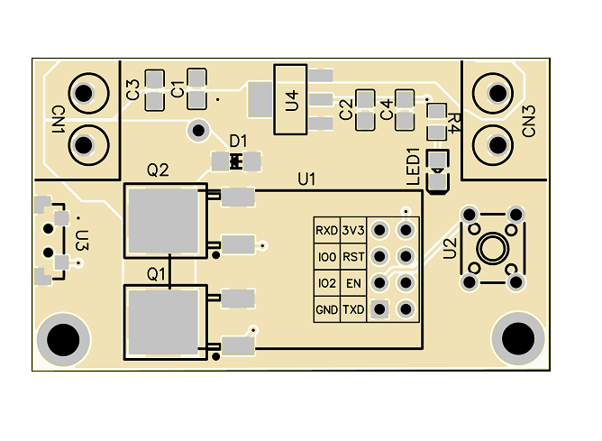
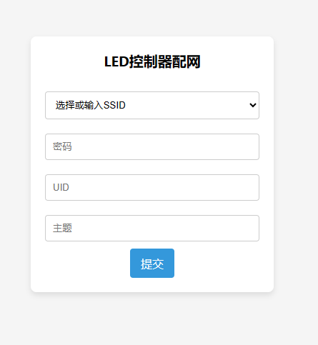
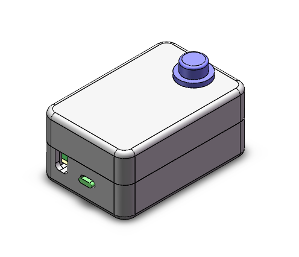
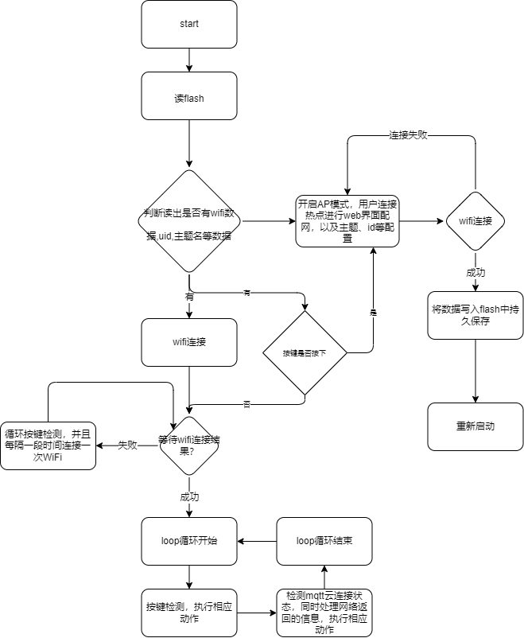
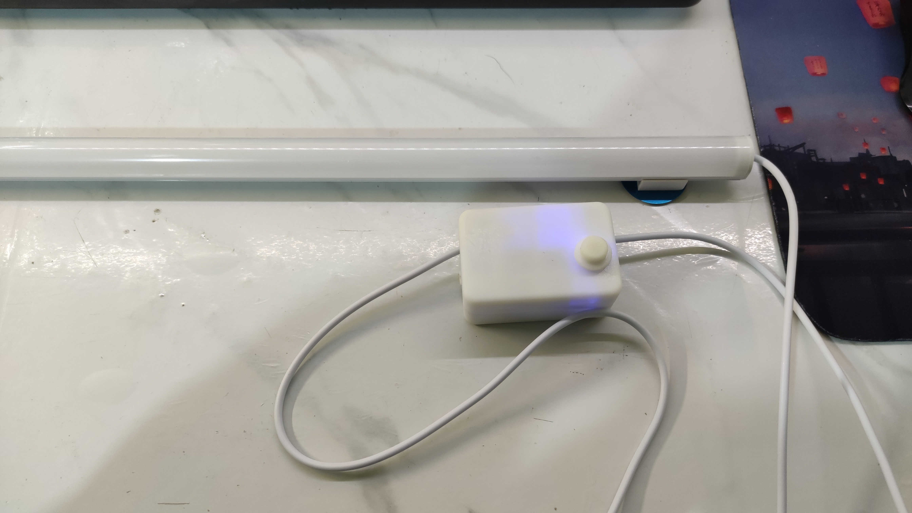
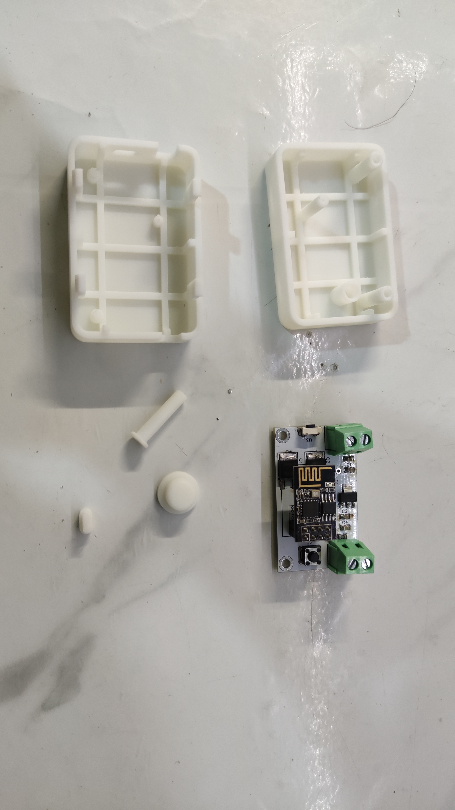

## 简介

该项目为一个物联网 LED灯类控制器，主要用于网络控制LED进行亮度调节和开关，实现语音控制-小爱同学；云平台为巴法云云平台

## 硬件

电路图以及pcb板详情请移至隔壁嘉立创项目 [LED_ESP01S](https://oshwhub.com/chasem/led_esp01s_2023-10-06_20-50-47)

## 软件

软件分为以下三部分

1. 云平台连接，使用巴法云的MQTT设备云
2. LED灯操作部分，通过按键操作灯的动作（短按开/关，长按调节亮度）
3. web配网部分，该程序提供web端配网部分，在该部分可以配置wifi名称，密码，巴法云UID，以及MQTT所需要的主题；

web配网页面展示如下

## 三维建模

三维建模使用solidworks进行三维建模

## 程序流程图

## 实物图片展示

